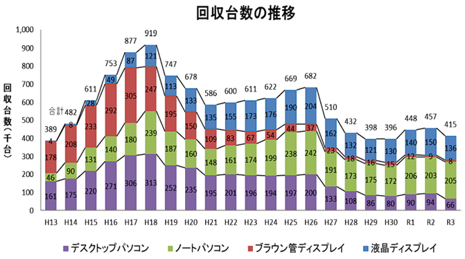
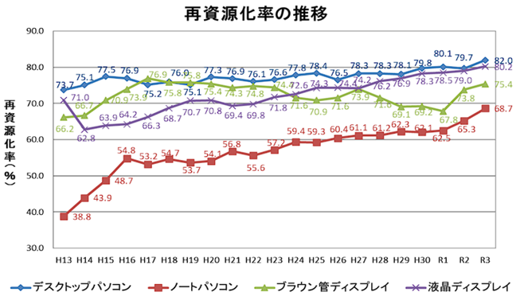
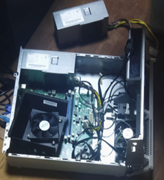
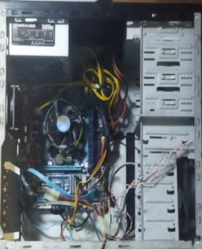

# SDGsに基づくパソコンのリサイクルについて
### 目的

 &emsp; 今、国際社会共通の目標となっているSDGsの中にある12番目の「つくる責任 つかう責任」という課題について自分でもなにかできないか着目してみた。そのとき古くなった型番のパソコンでもリサイクルが出来るということを広めることで力になると考えた。そのため、壊れているPCや使わなくなったPCを実際に使い、PCを組み立て、構成や仕組みに詳しくなり、自分の成長につなげる。

### 目標
1.	パソコンのリサイクルされている現状について調べる。
 1.	PCの仕組みをより詳しく調べる。
1.	PCのパーツの相性を調べ合うパーツを見つける。
1. PCのパーツを揃える。
1.	起動できるか確かめる。
 1.  スペックが低くなってもPCは使えるということを広める。(ホームページを制作し、誰もが見られるようにURLやQRコードを活用する。)
    
### パソコンのリサイクルについて　
 
 日本では現在、資源有効利用促進法という法律があり、メーカーによる回収が義務づけられています。回収されたパソコンは、再資源化施設においてデータ破壊や分解等の工程を経て再資源化され、樹脂や金属といった素材として再利用されます。経済産業省から毎年リサイクルの状況を公表しており、令和３年の自主回収実績は、回収重量が2281t、回収台数に置き換えると414,819台もの回収がされています。表1から見るに回収台数が平成18年をピークに徐々に減っていることが分かります。しかし、再資源量は、2166t中1686tもの再資源がされており表2より徐々に増えていることが分かります。

回収台数の推移（表１）

> 引用：[経済産業省ホームページ](https://www.meti.go.jp/)

再資源化率の推移（表2）

> 引用：[経済産業省ホームページ](https://www.meti.go.jp/)

### PC3R協会の方へのQ&A

一般社団法人パソコン3R推進協会（PC3R協会）とは、パソコンメーカー51社を会員として、使用済みのパソコンの再資源化に関する事業を行っている法人です

Q, パソコンはどのような再資源化が可能なのですか。

A, パソコンは、鉄、アルミニウム、銅といった金属やプラスチック類を素材としています。また、パソコンは様々な部品から構成されており、これを分解・解体し部品や素材ごとに選別することにより、再生利用の道が大きく開かれます。
例えば、鉄、アルミニウム、銅といった金属については、部品を分離し、それぞれの素材に選別することにより、金属製品の原料として再生利用が可能です。

Q, リサイクル施設ではどのような再資源化が行われるのですか。

A, 金属部品（筐体）、プラスチック部品（筐体、その他）、プリント板、ユニット部品（ＨＤＤなど）、液晶ユニット等に分類されます。ＨＤＤは、破壊し情報漏洩を防ぐ措置をとります。なお、家庭系パソコンの場合は、例外的な一部の部品を除いて部品として再利用されることはありません。

Q, 再資源化の目標は定められているのですか。

A, 再資源化を行ったパソコンの総重量と、再資源化により得られた部品、再生資源（化学的変化を生ぜしめる方法によるものを除く。）の総重量との比率で表される以下の指標が平成15年度の達成目標として設定されています。(デスクトップパソコン　５０％、ノートブックパソコン２０％、ブラウン管式ディスプレイ５５％、液晶式ディスプレイ５５％)

### パソコンの組み立て

### 〇必要な部品

CPU、メモリ、マザーボード、電源ユニット、PCケース、HDD/SSD、CPUクーラー、CPUグリス、グラフィックスボード、OS（Windows）、モニター、マウス、キーボード

### ※注意すること

-	CPUとマザーボードの用途が合うか。
-	BIOSのバージョンが対応しているか。
-	ファンの設置ミスをしていないか。
-	CPUクーラーの保護フィルムが外れているか。
-	CPUのソケットのピンを曲げてしまわないように注意する。
-	パーツのサイズが合うか。
-	アクセスランプなどの配線ミスをしていないか。
-	電源端子が足りなくならないか。
-	OSのインストール先のドライブ指定を間違わないようにする。

&emsp;&emsp;&emsp;&emsp;&emsp;&emsp;

### 感想

　今回このプロジェクトを経て多くのことを学ぶことができ、パソコンのリサイクルの現状を知ることができた。今世界の課題となっているSDGsについて自分はあまり触れてこなかったが、今回のことをきっかけに1つの課題だけでなく他の課題についても知り、世界にはまだこれだけの問題があるということを実感し、今後自分にも何かできることはないか、少しでも力になれることはないか探していきたいと思う。そして、パソコンについてもプロジェクトを始める前はあまり知識がなく疎かったが、実際にリサイクルのパソコンを自力で組み立てたことによってより詳しく知識を身に着けることができた。
